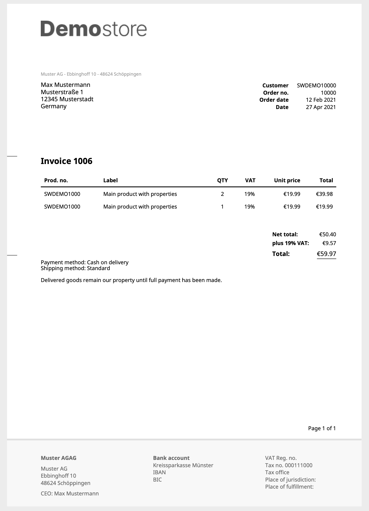

typeset.sh Shopware6 Plugin
===========================

This Shopware6 plugin provides an alternative PDF renderer using the
typeset.sh engine.

Typeset.sh is a html & css renderer written in PHP and does not require any
additional php extensions or APIs.


## Example


Here is a [sample pdf ouptut file](docs/example-invoice.pdf).


## Installation via Composer

Get access to your typeset.sh repository. 
See the [typeset.sh documentation](https://typeset.sh/en/documentation/php).

 ```bash
 composer config repositories.typeset composer https://packages.typeset.sh
 composer require typesetsh/shopware6-plugin
 php bin/console plugin:refresh
 php bin/console plugin:install -a -c TypesetshShopwarePlatform
 ```


## License

This plugin is under the [MIT license](LICENSE).

However, it requires a version of [typeset.sh](https://typeset.sh/) to work.
